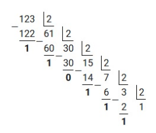

# Двоичные числа

На вход дано целое положительное число N. Выведите его в двоичной системе счисления без ведущих нулей.
## Пример

| **stdin** | **stdout** |
| --------- | ---------- |
| 5         | 101        |
| 32        | 100000     |
| 1         | 1          |
## Подсказки
- число N можно считывать в переменную типа **int**
- в этой задаче вам может пригодиться контейнер vector; напоминаем, что добавление значения **x** в конец вектора **v** делается так: **v.push_back(x);**

Перевод из десятичной системы счисления в двоичную 

Перед тем как перейти к алгоритму перевода, вспомним алфавит двоичной и десятичной системы счисления: 

| Основание | Название   | Алфавит                       |
| --------- | ---------- | ----------------------------- |
| 2         | Двоичная   | 0, 1                          |
| 10        | Десятичная | 0, 1, 2, 3, 4, 5, 6, 7, 8, 9  |
Для перевода чисел из десятичной системы в двоичную, воспользуемся соответствующим алгоритмом. 

Алгоритм перевода целых десятичных чисел в двоичную систему счисления 
1. Последовательно выполнять деление десятичного числа и получаемых целых частных на 2 до тех пор, пока частное не станет равным 0. 
2. Для получения ответа в двоичном коде необходимо записать полученные в результате деления остатки в обратном порядке. 

Пример 1: перевести десятичное число 123 в двоичную систему счисления. Для наглядности произведем деление «столбиком». Решение будет выглядеть следующим образом:
 

Исходя из вышеприведенного алгоритма, полученные остатки необходимо записать в обратном порядке. Ответ:
$123_{10}=1111011_2$